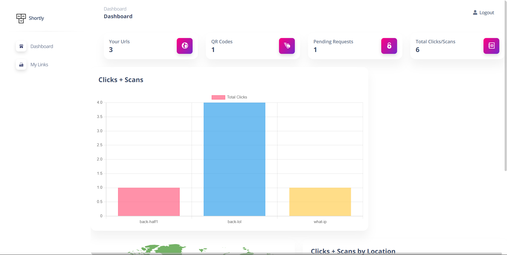
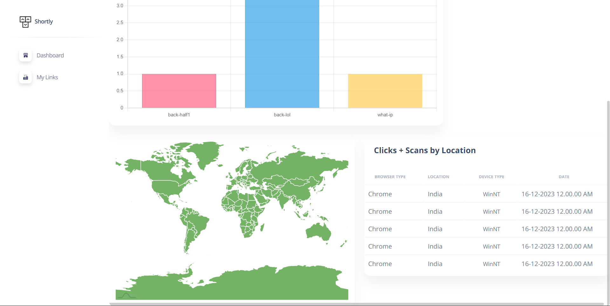
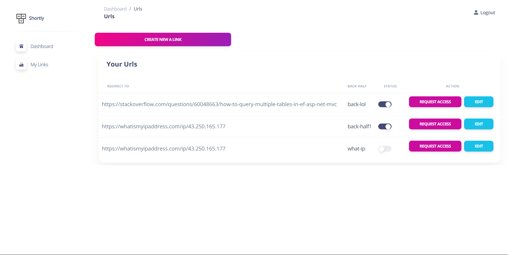
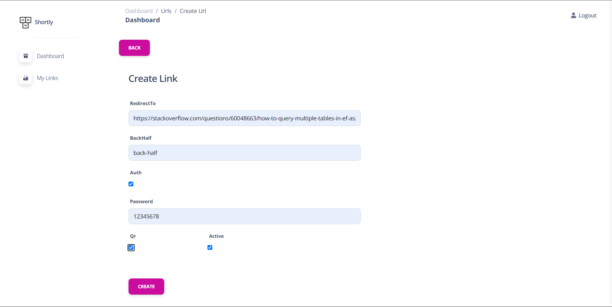
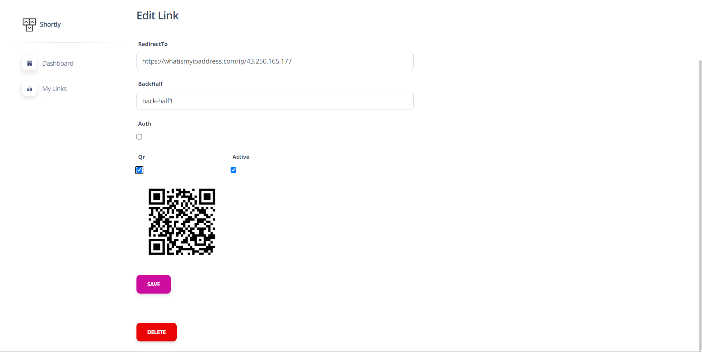
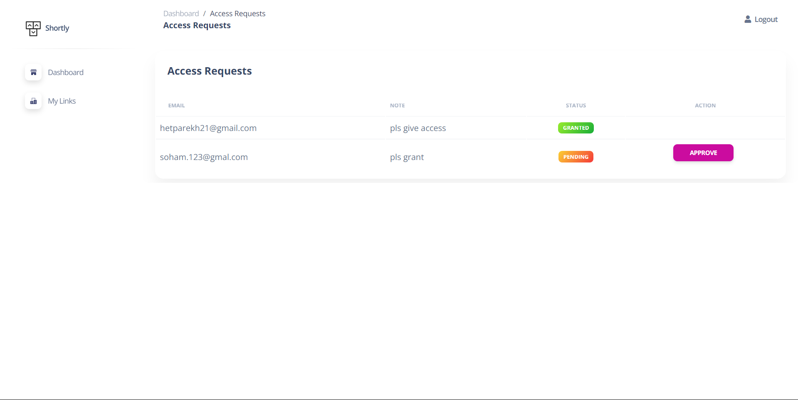

# 
Shortly URL Shortener

"Shortly" is a URL shortener web application developed using .NET MVC 5. It allows users to create, manage, and analyze shortened URLs with an intuitive dashboard and robust features.

## Features

- **User Dashboard:**
  - Visualize URL click and scan counts through an interactive bar graph.
  - Monitor the total number of URLs, QR codes, and pending access requests.
  - Display the latest 5 click details, including browser type, location, device type, and timestamp.

- **My URLs:**
  - View a comprehensive list of URLs with relevant information.
  - Toggle between active and inactive states for URLs.
  - Edit URLs on-the-fly.
  - Manage access requests and apply authentication for added security.

## Screenshots

## Getting Started

### Prerequisites

- [.NET SDK](https://dotnet.microsoft.com/download)
- [Visual Studio](https://visualstudio.microsoft.com/downloads/)
- SQL Server or another compatible database

## Acknowledgments

- **[Manan Shah](https://github.com/MananShah3654) :** Thank you or introducing us to the world of ASP.NET and for your mentorship and continuous encouragement.

## Contact

For inquiries and support, please contact [hetparekh21@gmail.com,satvarasoham@gmail.com].
